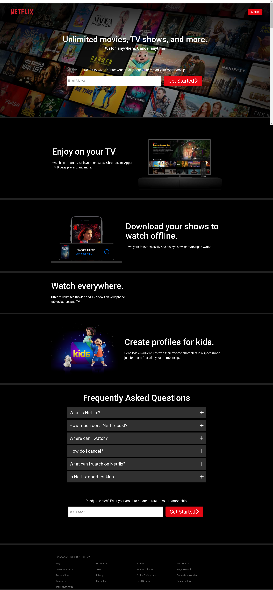

# Project Name - NetFlix Home Page Clone

This is a solution to the [NetFlix Home Page](https://www.netflix.co.za).

## Table of contents

- [Overview](#overview)
  - [The challenge](#the-challenge)
  - [Screenshot](#screenshot)
  - [Links](#links)
- [My process](#my-process)
  - [Built with](#built-with)
  - [What I learned](#what-i-learned)
  - [Continued development](#continued-development)
  - [Useful resources](#useful-resources)
- [Author](#author)

## Overview

### The challenge

Users should be able to:

- View the optimal layout for the site depending on their device's screen size
- See hover states for all interactive elements on the page

### Screenshot



### Links

- Solution URL: [Add solution URL here](https://your-solution-url.com)
- Live Site URL: [Add live site URL here](https://your-live-site-url.com)

## My process

### Built with

- Semantic HTML5 markup
- CSS custom properties
- Flexbox
- CSS Grid
- Mobile-first workflow

### What I learned

Use this section to recap over some of your major learnings while working through this project. Writing these out and providing code samples of areas you want to highlight is a great way to reinforce your own knowledge.

To see how you can add code snippets, see below:

```html
<a class="btn text-neutral-100 bg-primary-900 fs-btn" href="#">Sign In</a>
```

```html
<button class="cta | text-neutral-100 bg-primary-900 fs-cta">
  Get Started<span class="cta-icon"
    ><i class="fa-solid fa-chevron-right"></i
  ></span>
</button>
```

```html
<video
  src="./images/1.m4v"
  autoplay
  playisinline
  muted
  loop
  type="video/mp4"
></video>
```

```css
@media (min-width: 950px) {
  :root {
    --fs-cta: var(--fs-700);
    --fs-primary-heading: var(--fs-xl);
    --fs-qns: var(--fs-700);
    --fs-form-title: var(--fs-500);
  }
}
```

```css
.even-column-reverse {
  display: flex;
  flex-direction: row-reverse;
  justify-content: space-between;
  gap: 1rem;
  align-items: center;
  text-align: left;
}
```

```css
.question {
  min-width: clamp(645px, 815px, 100%);
}
```

```js
const proudOfThisFunc = () => {
  console.log("🎉");
};
```

### Continued development

- CSS Positioning
- Forms responsiveness
- CSS Grid and Flexbox
- CSS Utility classes

### Useful resources

- [Vite](https://vitejs.dev/) - This helped me to provide a faster and leaner development experience for modern web projects and website broiler plate. I really liked this build tool and will use it going forward..
- [Kevin Powel YouTube Channel](https://www.example.com) - This channel has a lot of tutorials on how to simplify your CSS. I'd recommend it to anyone who want to improve on CSS.
- [CSS Peeper Chrome Extension](https://www.example.com) - This extension helped me to get website assets inorder to make the clone. I'd recommend it to anyone who wants to clone any website.

## Author

- Website - [Add your name here](https://www.your-site.com)
- Twitter - [@pjuawo](https://www.twitter.com/pjuawo)
- Facebook - [@pjuawo](https://www.facebook.com/pjuawo)
